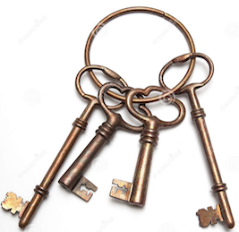

# JavaScript Objects

Objects are collections of values where each value can be retrieved 
or set by one specific key, aka **key/value** pairs.

## Keys



## Values (stored in memory)


## Use of Objects

* JavaScript uses a limited number of Data Structures to fulfill many roles.
* In other programming languages, you might only have very specific types of
data structures. 
* Almost everything (except `Number`, `String`, `Boolean`, `null` and `undefined`)
are "Objects".
* This includes:
    * `Array`
    * `Function`
    * `Date`
* So remember that even though they have their specialized uses, they can still
be used as Objects

## Getting and Setting Values

In JavaScript, any string can be used as a key. Using the square bracket notation:

```js
var obj = {};

obj['anything I want as a key'] = 42;

var value = obj['anything I want as a key'];

console.log(value);
// 42

```

Our primary use this style of property key will be using html/css
kebob-cased ids and classes.

In general JavaScript practice, we limit ourselves to camelCase property names (keys) with `a-z`, `A-Z`, `$`, `_`, and `0-9` (as long as it is not at the start of the property name).

This enables us to use the common short way of doing things:

```js
var obj = {};

obj.answer = 42;

var value = obj.answer;

console.log(value);
// 42

```


## Initializing Properties on Object Creation

In JavaScript, we can use "object literals" to create our initial object with 
key/value pairs (properties). We can also use `[]` for properties that contain
invalid characters for the shorthand style:

```js

var obj = {
    answer: 42,
    ['anything I want as a key']: 'But why?'
};
```

## Types of Uses of Objects

### Domain Modelling

Often, objects are used to describe "real-world" things. For example, 
a cup:

```js
var coffeeMug = {
    base: 2.25,
    height: 3,
    color: 'blue',
    dishwasherSafe: true,
    material: 'ceramic'
};

var pintGlass = {
    base: 3.25,
    height: 5.25,
    color: 'clear',
    dishwasherSafe: true,
    material: 'glass'
};
```

### Dictionaries (or Maps)

Another common use of object is to create a Dictionary or Map. Think of an index
at the back of the book. A keyword ("key") has a "value" of the page numbers on which that word
can be found.

For our use today, the `form.elements` is a dictionary with key/value pairs. 
The browser creates a key based on the `name` attribute of each form control in (child of) the
form and the value is either the form control itself, or a list of form controls if there
are multiple controls with the same `name` attribute.

```html
<form id="guess-form">
    <input name="name">
    <input name="color">
    <button>Guess</button>
</form>
```

The above form and controls can be accessed as:

```js

var form = document.getElementById('guess-form');
var elements = form.elements;

// Get a hold of the inputs:
var nameInput = elements.name;
var colorInput = elements.color;

// Now get the values of those inputs:
var name = nameInput.value;
var color = colorInput.value

```
